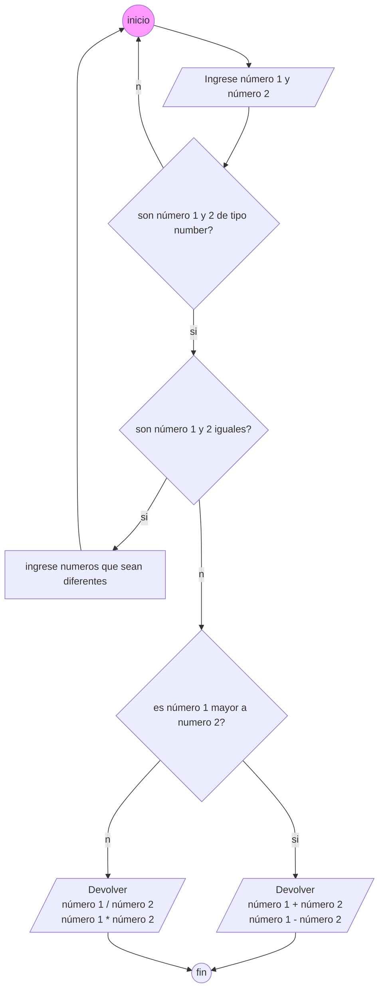
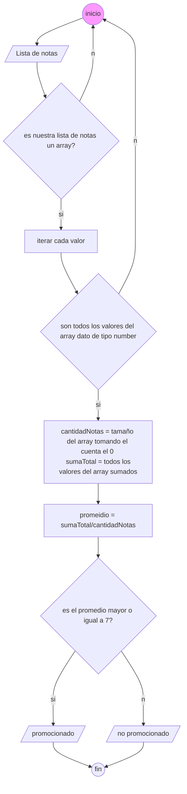
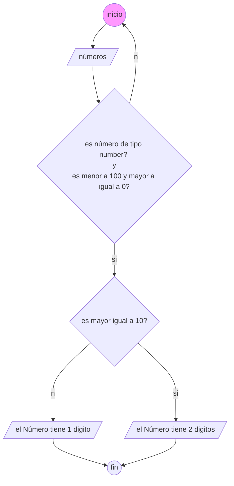

# Hoja de Trabajo 3
## Problema #1:
* Realizar un programa que solicite la carga por teclado de dos números, si el primero es mayor al segundo informar su suma y diferencia, en caso contrario informar el producto y la división del primero respecto al segundo.Problema 

```py
def  validar_tipo_de_dato(num1, num2):

return  isinstance(num1, (int, float)) and  isinstance(num2, (int, float))

  

def  validar_igualdad(num1, num2):

return  num1 == num2

  

def  validar_tamaño(num1, num2):

return  num1 > num2

  

def  alert():

print("¡Ingrese números que sean diferentes!")

  

def  devolver_suma_y_diferencia(num1, num2):

return  num1 + num2, num1 - num2

  

def  devolver_division_y_producto(num1, num2):

return  num1 / num2, num1 * num2

  

# Lógica principal

def  main():

while  True:

num1 = float(input("Ingrese número 1: "))

num2 = float(input("Ingrese número 2: "))

if  not  validar_tipo_de_dato(num1, num2):

print("¡Ingrese números válidos!")

continue

if  validar_igualdad(num1, num2):

alert()

continue

if  validar_tamaño(num1, num2):

suma, diferencia = devolver_suma_y_diferencia(num1, num2)

print("Suma:", suma)

print("Diferencia:", diferencia)

else:

division, producto = devolver_division_y_producto(num1, num2)

print("División:", division)

print("Producto:", producto)

reiniciar = input("¿Desea reiniciar? (s/n): ")

if  reiniciar.lower() != 's':

break

  

# Ejecutar el programa

main()
```
# Diagrama 2
> * Se ingresan tres notas de un alumno, si el promedio es mayor o igual a siete mostrar un mensaje "Promocionado".Problema 


```py
def  validar_array(notas):

return  isinstance(notas, list)

  

def  validar_valores_array(notas):

return  all(isinstance(nota, (int, float)) for  nota  in  notas)

  

def  operar(notas):

cantidad_notas = len(notas)

suma_total = sum(notas)

return  cantidad_notas, suma_total

  

def  obtener_promedio(suma_total, cantidad_notas):

return  suma_total / cantidad_notas

  

def  esta_aprobado(promedio):

return  promedio >= 7

  

# Lógica principal

def  main(notas):

if  not  validar_array(notas):

print("La lista de notas no es un array válida.")

return

if  not  validar_valores_array(notas):

print("Los valores en la lista de notas deben ser números.")

return

cantidad_notas, suma_total = operar(notas)

promedio = obtener_promedio(suma_total, cantidad_notas)

if  esta_aprobado(promedio):

print("El estudiante está promocionado.")

else:

print("El estudiante no está promocionado.")

  

# Ejemplo de uso

notas = [2, 1, 3, 2, 1] # Lista de notas

main(notas)
```
# Diagrama 3:
> * Se ingresa por teclado un número positivo de uno o dos dígitos (1..99) mostrar un mensaje indicando si el número tiene uno o dos dígitos.(Tener en cuenta que condición debe cumplirse para tener dos dígitos un número entero)


```py
def validar_numero(numero):
    if isinstance(numero, (int, float)) and 0 <= numero < 100:
        return True
    return False

def validar_digito(numero):
    if numero >= 10:
        return True
    return False

def main():
    try:
        numero = float(input("Ingrese un número entre 0 y 99: "))
        if not validar_numero(numero):
            print("El número no es válido.")
            return

        if validar_digito(numero):
            print("El número tiene dos dígitos.")
        else:
            print("El número tiene un dígito.")
    except ValueError:
        print("Error: Ingrese un número válido.")

# Llamada a la función principal
main()

```
