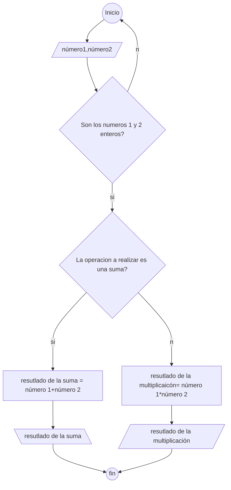
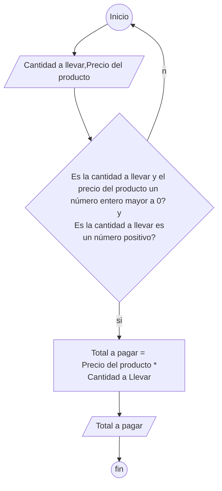
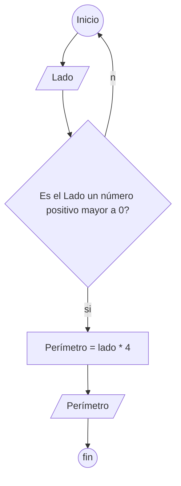

# Problema #1:

> * Realizar la carga de dos números enteros por teclado e imprimir su suma y su producto.

# Problema #2:

> * Realizar la carga del precio de un producto y la cantidad a llevar. 
> * Mostrar cuanto se debe pagar 
> * (se ingresa un valor entero en el precio del producto).

# Problema #3:

> * Realizar la carga del lado de un cuadrado, mostrar por pantalla el perímetro del 
mismo (El perímetro de un cuadrado se calcula multiplicando el valor del lado por cuatro)

